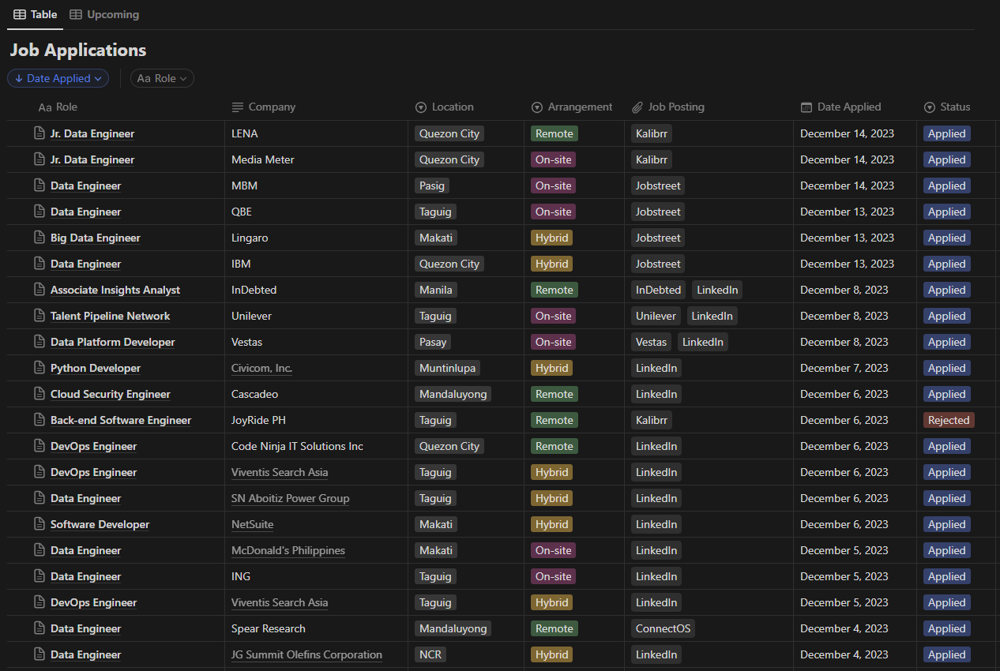

# Converting Notion Database to Obsidian Database

## Overview
I have a database in Notion, which I use to track my job applications, and I wanted to move this database into Obsidian. There's this plugin for Obsidian called DB Folder that allows creation of databases similar to that in Notion. However, the files have to be in a specific format for the plugin to work seamlessly. In addition, the exported files from Notion are quite messy and needs cleaning. 

This repo contains the scripts I used to automate the renaming, editing, and tagging of database files exported from Notion, in order for them to be compatible with the DB folder plugin from Obsidian.

## Steps
Here are the steps I took to accomplish the task:

1. I exported the database files from Notion. The extracted folder contains files similar to the samples found in `database_files/raw_files`:

2. The first line in each file consist of the job title, so I wrote `rename_md_files.py` to rename the files based on their first lines (removing the hashtag first). Note: the script renames the files in place, meaning the original files are changed.

3. For the DB Folder plugin to work seamlessly, I have to format the metadata found in the first few lines of each file into YAML format, so I wrote edit_md_files.py which accepts the path of directory containing all the files to edit, and then rewrites these files into another directory, following the proper format. The original files are not changed. 

4. Since I use tags in Obsidian, I wrote `add_tag.py` to automate tagging of files, rather than manually adding the tags in Obsidian.

5. Finally, I imported the edited files into Obsidian and used the plugin to setup my job applications database :)